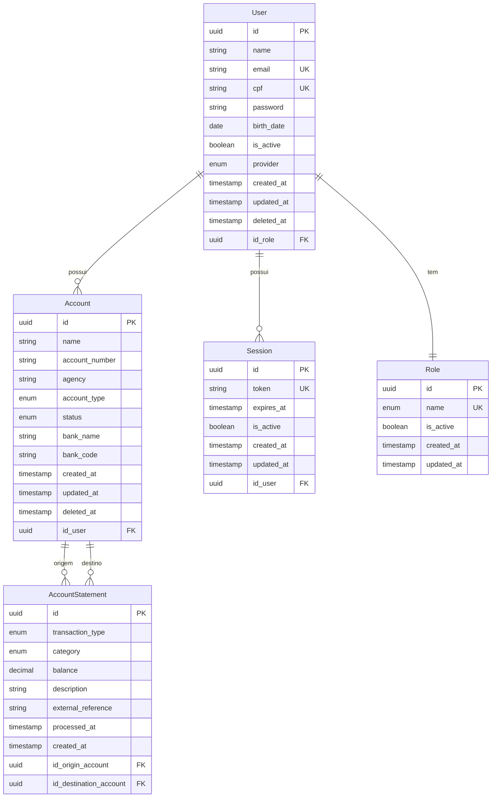

# LW API - Sistema de Gestão de Contas Bancárias

## Visão Geral

Este projeto é uma API robusta baseada em NestJS para gerenciamento de contas bancárias digitais, operações financeiras e controle de movimentações. O sistema fornece funcionalidades completas para criação de contas, processamento de transações (depósitos, saques e transferências) e acompanhamento de extratos bancários em tempo real.

## Funcionalidades

### Gestão de Usuários e Autenticação
- Registro e autenticação de usuários
- Controle de acesso baseado em roles (SADMIN, ADMIN, MANAGER, USER, GUEST)
- Sistema de sessões com JWT
- Validação de CPF e dados pessoais

### Gestão de Contas Bancárias
- Criação de contas bancárias com saldo inicial
- Suporte para diferentes tipos de conta (Corrente, Poupança, Empresarial)
- Listagem paginada e filtrada de contas
- Consulta de saldo em tempo real

### Operações Financeiras
- **Depósitos**: Processamento de depósitos via eventos
- **Saques**: Validação de saldo e processamento de saques
- **Transferências**: Transferências entre contas internas
- Histórico completo de movimentações

### Controle de Movimentações
- Extrato bancário detalhado
- Filtros por data, tipo de transação, categoria
- Busca por nome/número da conta
- Paginação e ordenação customizáveis

## Arquitetura

### Princípios Arquiteturais

O projeto foi desenvolvido como um monolito modular seguindo rigorosamente os princípios **SOLID**, garantindo um código limpo, testável e de fácil manutenção:

#### **Single Responsibility Principle (SRP)**
Cada serviço possui uma única responsabilidade bem definida:

- `CreateAccountService`: Responsável apenas pela criação de contas bancárias
- `ListAccountsService`: Responsável apenas pela listagem de contas
- `GetAccountBalanceService`: Responsável apenas pela consulta de saldo
- `ListMovementsService`: Responsável apenas pela listagem de movimentações
- `DepositProcessor`: Responsável apenas pelo processamento de depósitos
- `WithdrawProcessor`: Responsável apenas pelo processamento de saques
- `TransferProcessor`: Responsável apenas pelo processamento de transferências

#### **Open/Closed Principle (OCP)**
O sistema é aberto para extensão, mas fechado para modificação:

- **Factory Pattern**: `TransactionProcessorFactory` permite adicionar novos tipos de processadores sem modificar código existente
- **Interfaces**: Uso extensivo de interfaces para definir contratos extensíveis
- **Injeção de Dependências**: Permite substituição de implementações sem modificar código cliente

#### **Liskov Substitution Principle (LSP)**
Implementações concretas são substituíveis por suas interfaces:

- `IAccountRepository` pode ser implementado por diferentes tipos de repositórios
- `ITransactionProcessor` permite diferentes implementações de processadores
- `IListAccountsService` pode ter diferentes implementações mantendo o mesmo contrato

#### **Interface Segregation Principle (ISP)**
Interfaces são específicas e focadas:

- `IAccountRepository`: Interface específica para operações de conta
- `IStatementRepository`: Interface específica para operações de extrato
- `ITransactionProcessor`: Interface específica para processamento de transações
- DTOs específicos para cada operação (CreateAccountRequestDto, ListAccountsRequestDto, etc.)

#### **Dependency Inversion Principle (DIP)**
Módulos de alto nível não dependem de módulos de baixo nível:

- Serviços dependem de interfaces de repositório, não de implementações concretas
- Controladores dependem de interfaces de serviço
- Factory retorna interfaces, não implementações específicas

### Factory Pattern para Operações Financeiras

O sistema utiliza o **Factory Pattern** para gerenciar operações financeiras:

```typescript
// TransactionProcessorFactory
createProcessor(eventType: EventType): ITransactionProcessor {
  switch (eventType) {
    case EventType.DEPOSIT:
      return this.depositProcessor;
    case EventType.WITHDRAW:
      return this.withdrawProcessor;
    case EventType.TRANSFER:
      return this.transferProcessor;
    default:
      throw new BadRequestException(`Tipo de evento não suportado: ${eventType}`);
  }
}
```

**Benefícios do Factory Pattern:**
- **Extensibilidade**: Novos tipos de transação podem ser adicionados facilmente
- **Desacoplamento**: Cliente não precisa conhecer implementações específicas
- **Reutilização**: Processadores podem ser reutilizados em diferentes contextos
- **Testabilidade**: Cada processador pode ser testado independentemente

### Uso de Interfaces em Services e Repositories

Todas as camadas do sistema utilizam interfaces para garantir baixo acoplamento:

#### **Services com Interfaces**
```typescript
// Interface do serviço
export interface ICreateAccountService {
  perform(userId: string, accountData: CreateAccountRequestDto): Promise<CreateAccountResponseDto>;
}

// Implementação concreta
@Injectable()
export class CreateAccountService implements ICreateAccountService {
  // Implementação...
}
```

#### **Repositories com Interfaces**
```typescript
// Interface do repositório
export interface IAccountRepository extends IBaseRepository<Account> {
  findByFilters(userId: string, filters: ListAccountsRequestDto): Promise<[Account[], number]>;
  findUserAccountByAccountNumber(userId: string, accountNumber: string): Promise<Account | null>;
  createAccountWithInitialStatement(accountData: CreateAccountRequestDto, balance: number, userId: string): Promise<{ account: Account; balance: number }>;
}

// Implementação concreta
@Injectable()
export class AccountRepository extends BaseRepository<Account> implements IAccountRepository {
  // Implementação...
}
```

### Benefícios da Arquitetura

- **Modularidade**: Cada módulo (auth, accounts, user) é independente
- **Testabilidade**: Interfaces facilitam a criação de mocks e testes unitários
- **Manutenibilidade**: Código organizado e responsabilidades bem definidas
- **Escalabilidade**: Arquitetura permite adicionar novos módulos sem impacto
- **Flexibilidade**: Implementações podem ser substituídas sem afetar o sistema
- **Reutilização**: Componentes comuns são compartilhados através do módulo `common`

### Estrutura de Diretórios

```
src/
├── common/                     # Código compartilhado entre módulos
│   ├── configs/               # Configurações globais (CORS, Swagger)
│   ├── core/                  # Componentes base (DTOs, Repositories, Utils)
│   ├── filters/               # Filtros de exceção globais
│   ├── guards/                # Guards de autenticação e autorização
│   └── strategy/              # Estratégias de autenticação (JWT)
│
├── database/                  # Configuração e entidades do banco
│   ├── entities/              # Entidades do TypeORM
│   └── scripts/               # Scripts de seed e migrações
│
├── modules/                   # Módulos da aplicação
│   ├── auth/                  # Módulo de autenticação
│   │   ├── controllers/       # Controladores de autenticação
│   │   ├── dtos/              # DTOs específicos de auth
│   │   ├── repositories/      # Repositórios de sessão
│   │   └── services/          # Serviços de autenticação
│   │
│   ├── user/                  # Módulo de usuários
│   │   ├── controllers/       # Controladores de usuário
│   │   ├── dtos/              # DTOs específicos de usuário
│   │   ├── repositories/      # Repositórios de usuário
│   │   └── services/          # Serviços de usuário
│   │
│   ├── accounts/              # Módulo de contas bancárias
│   │   ├── controllers/       # Controladores (Account, Event, Movements)
│   │   ├── dtos/              # DTOs específicos de contas
│   │   ├── repositories/      # Repositórios (Account, Statement)
│   │   └── services/          # Serviços organizados por funcionalidade
│   │       ├── account/       # Serviços de conta
│   │       ├── movements/     # Serviços de movimentação
│   │       └── transaction/   # Serviços de transação
│   │           ├── factories/ # Factory para processadores
│   │           └── processors/ # Processadores específicos
│   │
│   ├── access-control/        # Módulo de controle de acesso
│   │   ├── dtos/              # DTOs de roles
│   │   ├── repositories/      # Repositórios de roles
│   │   └── services/          # Serviços de roles
│   │
│   ├── password/              # Módulo de gerenciamento de senha
│   └── reset/                 # Módulo de reset do sistema
│
├── app.module.ts              # Módulo principal da aplicação
└── main.ts                    # Ponto de entrada da aplicação
```

### Responsabilidades por Camada

#### **Controllers**
- Gerenciam requisições HTTP
- Validam parâmetros de entrada
- Delegam lógica de negócio para services
- Retornam respostas formatadas

#### **Services**
- Contêm lógica de negócio
- Implementam regras de validação
- Coordenam operações entre repositórios
- Cada service tem responsabilidade única

#### **Repositories**
- Abstraem acesso ao banco de dados
- Implementam queries específicas
- Estendem repositório base para operações comuns
- Mantêm independência de ORM

#### **DTOs (Data Transfer Objects)**
- Definem estrutura de dados de entrada e saída
- Implementam validações automáticas
- Documentam API através de decorators Swagger
- Garantem type safety

## Modelagem do Banco de Dados



## Relacionamentos entre Entidades

### Usuário (User)
- Relacionamento Um-para-Muitos com Account
- Relacionamento Um-para-Muitos com Session
- Relacionamento Muitos-para-Um com Role
- Restrições únicas em email e CPF
- Exclusão lógica habilitada

### Conta (Account)
- Relacionamento Muitos-para-Um com User
- Relacionamento Um-para-Muitos com AccountStatement (origem e destino)
- Tipos: CHECKING, SAVINGS, BUSINESS
- Status: ACTIVE, INACTIVE, BLOCKED
- Exclusão lógica habilitada

### Extrato (AccountStatement)
- Relacionamento Muitos-para-Um com Account (origem)
- Relacionamento Muitos-para-Um com Account (destino)
- Tipos de transação: DEPOSIT, DEBIT
- Categorias: DEPOSIT, WITHDRAW, TRANSFER
- Indexação por conta e data para performance

### Role
- Relacionamento Um-para-Muitos com User
- Tipos: SADMIN, ADMIN, MANAGER, USER, GUEST
- Controle de acesso baseado em roles

### Sessão (Session)
- Relacionamento Muitos-para-Um com User
- Gerenciamento de tokens JWT
- Controle de expiração

## Stack Tecnológica

- **Framework**: NestJS
- **Linguagem**: TypeScript
- **ORM**: TypeORM
- **Banco de Dados**: PostgreSQL
- **Containerização**: Docker & Docker Compose
- **Autenticação**: JWT (JSON Web Tokens)
- **Validação**: class-validator & class-transformer
- **Documentação**: Swagger/OpenAPI
- **Testes**: Jest
- **Linting**: ESLint
- **Formatação**: Prettier

## Endpoints da API

### Autenticação
- `POST /auth/login` - Autenticação de usuários
- `POST /auth/logout` - Logout e invalidação de sessão

### Usuários
- `POST /user/register` - Registro de novos usuários
- `GET /user` - Obter dados do usuário autenticado

### Contas Bancárias
- `GET /accounts` - Listar contas com paginação e filtros
- `POST /accounts/create` - Criar nova conta com saldo inicial
- `GET /accounts/:id/balance` - Consultar saldo da conta

### Operações Financeiras
- `POST /event` - Processar operações financeiras (depósito, saque, transferência)

### Movimentações
- `GET /movements` - Listar movimentações com filtros avançados

### Utilitários
- `DELETE /reset` - Reset completo do sistema (desenvolvimento)

### Validações Implementadas

#### Validações de Negócio
- **Saldo Suficiente**: Validação antes de saques e transferências
- **Contas Existentes**: Verificação de existência antes de operações
- **Valores Positivos**: Validação de valores em transações
- **Tipos de Conta**: Validação de tipos permitidos
- **CPF**: Validação de formato e unicidade

#### Validações de Entrada
- **DTOs**: Validação automática com class-validator
- **Tipos de Dados**: Validação de tipos TypeScript
- **Formatos**: Validação de email, CPF, datas
- **Campos Obrigatórios**: Validação de presença de dados


## Como Executar o Projeto

### Pré-requisitos

- Node.js (versão 18 ou superior)
- Docker e Docker Compose
- PostgreSQL (se não estiver usando Docker)

### Configuração do Ambiente

1. Clone o repositório:
```bash
git clone git@github.com:victordsantoss/lw-api.git
cd lw-api
```

2. Instale as dependências:
```bash
npm install
```

3. Configure as variáveis de ambiente:
```bash
cp .env.example .env
```

### Executando com Docker

1. Inicie os containers:
```bash
docker-compose up -d
```

2. Execute as migrações/seeds:
```bash
npm run seed:roles
```

# Testes
npm run test            # Executar testes unitários

npm run test:cov        # Executar testes com cobertura

# Seeds
npm run seed:roles      # Popular tabela de roles

### Documentação da API

Após iniciar o servidor, a documentação Swagger estará disponível em: 
```
 http://localhost:3000/api 

```